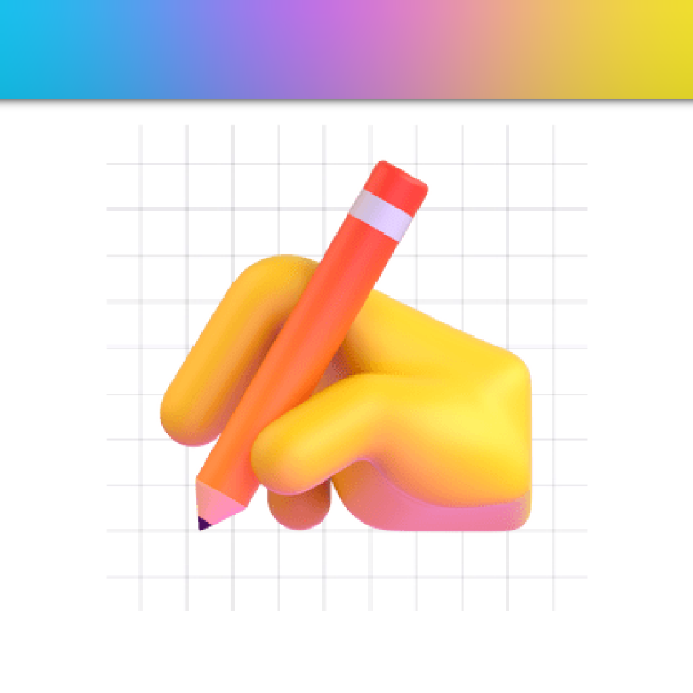

<a></img></a>

<h3 align="center">All you have to know about me is that i am building fun apps ✨</h3>

# 
⚙️ Technical Skills

You know lol ...

# 
🤫 Current Projects

  <a href="http://vibeswidget.com" style="display: flex; align-items: center; text-decoration: none; padding: 10px; border: 1px solid #2f353d; border-radius: 20px; width: 100%; max-width: 400px;">
    
    Vibes (+2.3m users)
  </a>
  <a href="http://dreamoji.ai" style="display: flex; align-items: center; text-decoration: none; padding: 10px; border: 1px solid #2f353d; border-radius: 20px; width: 100%; max-width: 400px;">
    
    Dreamoji (+230k users)
  </a>
  <a href="" style="display: flex; align-items: center; text-decoration: none; padding: 10px; border: 1px solid #2f353d; border-radius: 20px; width: 100%; max-width: 400px;">
    
    Open source projects (+30k uses)
  </a>
  <a href="http://revisio-ai.web.app" style="display: flex; align-items: center; text-decoration: none; padding: 10px; border: 1px solid #2f353d; border-radius: 20px; width: 100%; max-width: 400px;">
    
    Cogito (⏳)
  </a>
  <a href="" style="display: flex; align-items: center; text-decoration: none; padding: 10px; border: 1px solid #2f353d; border-radius: 20px; width: 100%; max-width: 400px;">
    Locked In (⏳)
  </a>

# 
🔗 Contacts

  
  
  

