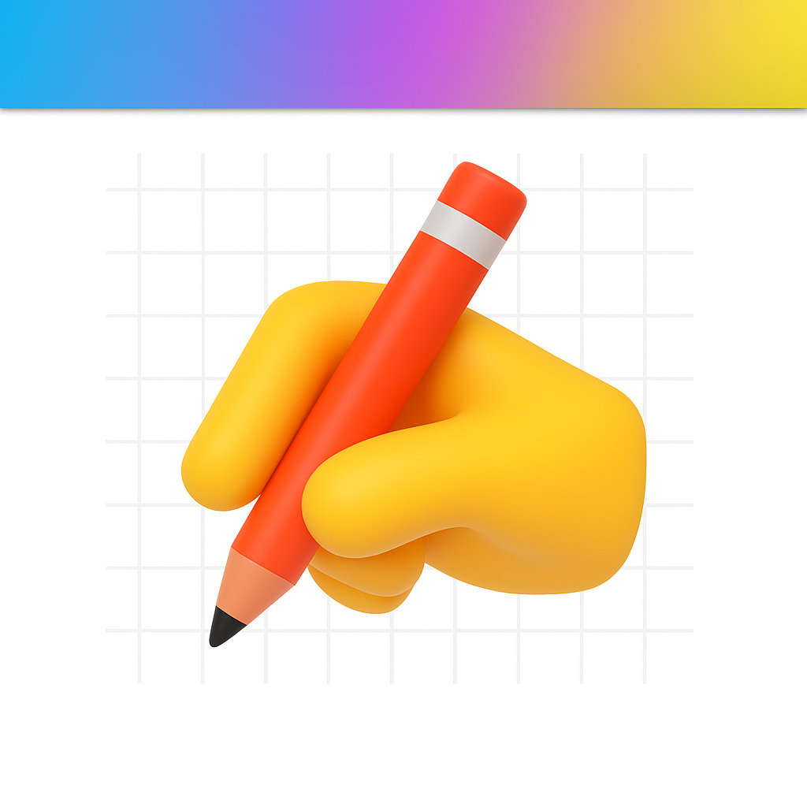

<a></img></a>

<h3 align="center">All you have to know about me is that i am building fun apps ✨</h3>

# 
⚙️ Technical Skills

SwiftUI & Java

# 
🤫 Current Projects

<table align="center">
  <tr>
    <td>
      
    </td>
    <td>
      <a href="http://vibeswidget.com" style="text-decoration: none;">
        Vibes (+3m users)
      </a>
    </td>
  </tr>
  <tr>
    <td>
      
    </td>
    <td>
      <a href="http://dreamoji.ai" style="text-decoration: none;">
        Dreamoji (+300k users)
      </a>
    </td>
  </tr>
  <tr>
    <td>
      
    </td>
    <td>
      <a href="" style="text-decoration: none;">
        Open source projects (+30k uses)
      </a>
    </td>
  </tr>
  <tr>
    <td>
      
    </td>
    <td>
      <a href="http://cognifynote.com" style="text-decoration: none;">
        Cognify (+40k users)
      </a>
    </td>
  </tr>
  <tr>
</table>

# 
🔗 Contacts

  
  
  

