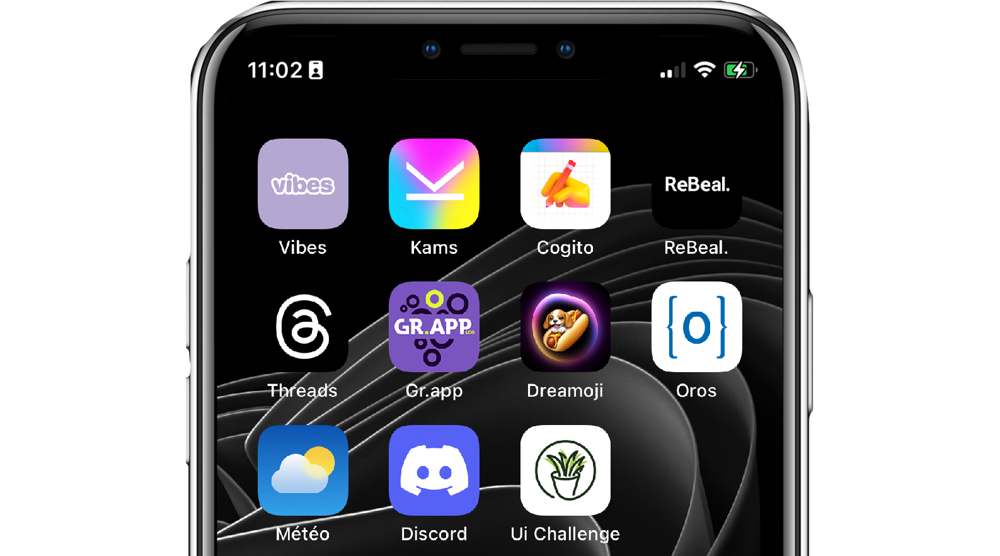

<a></img></a>

<h3 align="center">I'm Antoine Gonthier, 19 y.o, Epitech Student & Full-stack Flutter developer passionate about developing cool graphical interface on the application that I develop. I love developing servers in order to create link between people, innovate & learn new technologies.</h3>

# 
⚙️ Technical Skills

  

  

# 
🎨 Favorite Project

<h3 align="center">I am the founder of Kams which is a social network that allows artist to publish their creation without quality lost and ensure protection of intellectual properties.</h3>

# 
🔗 Links

  
  
  

